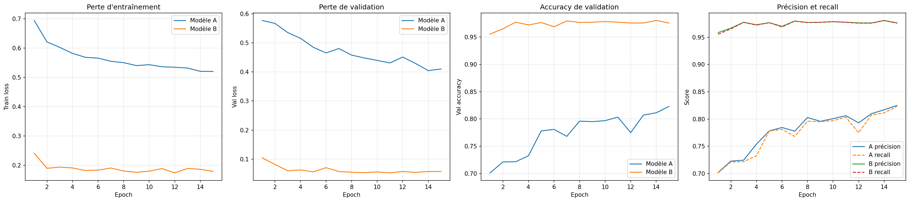
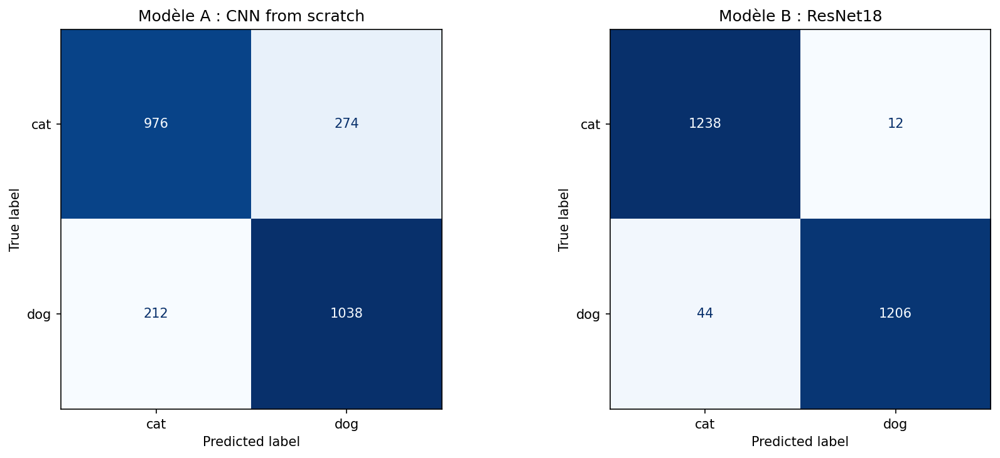
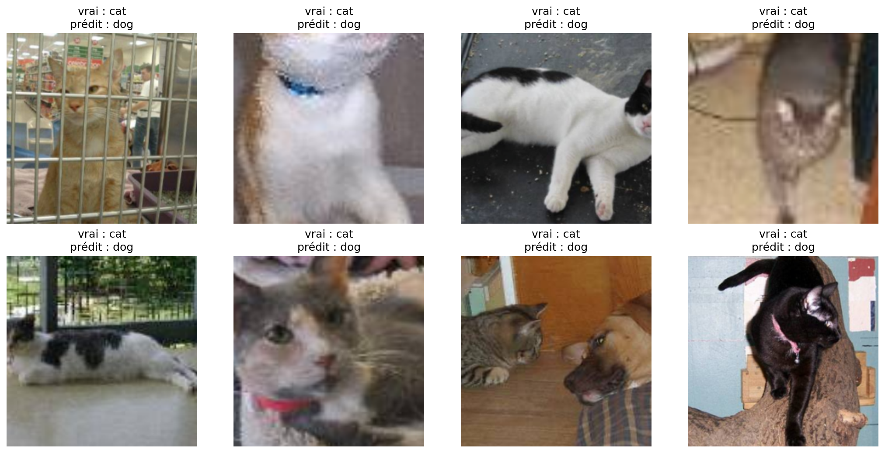

# CNN from scratch vs Transfert Learning — Cats vs Dogs

Comparaison de deux approches de classification binaire d'images : un CNN
entraîné entièrement à partir de zéro et un ResNet18 pré-entraîné sur
ImageNet en feature extraction.

**Résultat principal : 97,8 % d'accuracy en transfert learning contre
80,6 % from scratch, avec environ 50 000 fois moins de paramètres
entraînés.**

---

## Table des matières

- [CNN from scratch vs Transfert Learning — Cats vs Dogs](#cnn-from-scratch-vs-transfert-learning--cats-vs-dogs)
  - [Table des matières](#table-des-matières)
  - [Objectif](#objectif)
  - [Environnement](#environnement)
  - [Organisation des données](#organisation-des-données)
  - [Structure du dépôt](#structure-du-dépôt)
  - [Méthodologie](#méthodologie)
    - [Modèle A : CNN from scratch](#modèle-a--cnn-from-scratch)
    - [Modèle B : transfert learning (ResNet18)](#modèle-b--transfert-learning-resnet18)
  - [Entraînement](#entraînement)
  - [Évaluation](#évaluation)
  - [Résultats](#résultats)
    - [Recherche du learning rate — Modèle A](#recherche-du-learning-rate--modèle-a)
    - [Comparaison des optimiseurs — Modèle B](#comparaison-des-optimiseurs--modèle-b)
    - [Courbes comparées (validation)](#courbes-comparées-validation)
    - [Résultats finaux sur le jeu de test](#résultats-finaux-sur-le-jeu-de-test)
    - [Matrices de confusion](#matrices-de-confusion)
    - [Erreurs typiques](#erreurs-typiques)
  - [Analyse](#analyse)
  - [Limites et pistes d'amélioration](#limites-et-pistes-damélioration)
  - [Auteur](#auteur)

---

## Objectif

Ce projet compare deux stratégies pour classer des images de chats et de
chiens :

* **Expérience A** : un CNN convolutif à trois blocs, entraîné entièrement
  depuis une initialisation aléatoire.
* **Expérience B** : un ResNet18 pré-entraîné sur ImageNet, dont le
  backbone est gelé et seule la couche de classification est réentraînée.

L'objectif est de mesurer l'impact du transfert d'apprentissage sur trois
dimensions : la performance finale, la vitesse de convergence et le coût
d'entraînement.

---

## Environnement

Développé et exécuté sur **Google Colab**, GPU **Tesla T4**, Python 3.13.

```bash
pip install -r requirements.txt
```

| Bibliothèque | Version |
| ------------ | ------- |
| torch        | 2.11.0  |
| torchvision  | 0.26.0  |
| scikit-learn | 1.6.1   |
| numpy        | 2.1.3   |
| matplotlib   | 3.10.0  |

Les versions de `torch` et `torchvision` correspondent à celles de Colab.
Pour une installation locale avec GPU, voir [pytorch.org](https://pytorch.org)
selon la version de CUDA disponible.

L'entraînement sur CPU est possible mais déconseillé : environ 2 minutes par
epoch sur T4 contre plusieurs heures sur processeur.

**Reproductibilité.** Les graines de `random`, `numpy` et `torch` (CPU et GPU)
sont fixées à 42. cuDNN est configuré en mode déterministe
(`deterministic = True`, `benchmark = False`), au prix d'un léger
ralentissement des convolutions.

---

## Organisation des données

Jeu de données : [Cats vs Dogs (Udacity)](https://s3.amazonaws.com/content.udacity-data.com/nd089/Cat_Dog_data.zip)

Le jeu de données n'est pas inclus dans ce dépôt en raison de sa taille.
Téléchargez l'archive avec le lien ci-dessus et décompressez-la à la racine
du projet pour obtenir la structure suivante :

```text
Cat_Dog_data/
├─ train/
│  ├─ cat/    11 275 images
│  └─ dog/    11 250 images
└─ test/
   ├─ cat/     1 250 images
   └─ dog/     1 250 images
```

**Découpage.** Le dossier `train` est divisé en 80 % entraînement
(18 020 images) et 20 % validation (4 505 images) via `random_split` avec
un générateur à graine fixe.

Le dossier `test` (2 500 images) est réservé à l'évaluation finale. Il
n'intervient ni dans l'entraînement, ni dans le choix des hyperparamètres,
ni dans la sélection du checkpoint.

**Prétraitement.**

| Jeu               | Transformations                                                                       |
| ----------------- | ------------------------------------------------------------------------------------- |
| Entraînement      | RandomResizedCrop(224), RandomHorizontalFlip, RandomRotation(15), ToTensor, Normalize |
| Validation / Test | Resize(256), CenterCrop(224), ToTensor, Normalize                                     |

Normalisation avec les statistiques ImageNet
(`mean = [0.485, 0.456, 0.406]`, `std = [0.229, 0.224, 0.225]`),
indispensables pour le modèle pré-entraîné et appliquées aux deux modèles
pour garantir des conditions identiques.

Le dossier `train` est chargé deux fois, avec et sans augmentation, puis
découpé avec le même générateur. Cela garantit que la validation n'hérite
pas des transformations aléatoires du train, tout en portant sur exactement
les mêmes images.

**Note d'exécution.** Les données sont copiées de Google Drive vers le
disque local de Colab avant l'entraînement. La lecture de 22 500 fichiers
depuis Drive était le goulot d'étranglement, le GPU restant sous-utilisé.

---

## Structure du dépôt

```text
cnn-catsdogs-DialloSalou/
├─ notebook.ipynb          # notebook complet, de la préparation à l'analyse
├─ figures/
│  ├─ comparaison.png      # courbes comparées des deux modèles
│  ├─ confusion.png        # matrices de confusion sur le test
│  └─ erreurs.png          # exemples d'images mal classées
├─ requirements.txt
├─ .gitignore
└─ README.md
```

Les checkpoints (`*.pth`) et les données ne sont pas versionnés.

---

## Méthodologie

### Modèle A : CNN from scratch

```text
Entrée  [3, 224, 224]
Bloc 1  Conv2d(3→32)   + BatchNorm + ReLU + MaxPool   →  [32, 112, 112]
Bloc 2  Conv2d(32→64)  + BatchNorm + ReLU + MaxPool   →  [64, 56, 56]
Bloc 3  Conv2d(64→128) + BatchNorm + ReLU + MaxPool   →  [128, 28, 28]
Flatten                                               →  100 352
Linear(100352 → 512) + ReLU + Dropout(0.5)
Linear(512 → 2)
```

Toutes les convolutions utilisent `kernel_size=3`, `stride=1`, `padding=1`.
La réduction spatiale est confiée aux MaxPool.

**Total : 51 475 458 paramètres**, tous entraînés.

**BatchNorm** : placée après chaque convolution, avant la ReLU. Elle
recentre les sorties de la convolution, ce qui stabilise l'apprentissage et
autorise un learning rate plus élevé.

**Dropout** : placé uniquement dans le classifieur, après la première
couche Linear. Plus de 99 % des paramètres du réseau se trouvent dans
`fc1`, le risque de surapprentissage y est donc concentré. Les blocs
convolutifs sont déjà régularisés par le partage de poids et la BatchNorm.

### Modèle B : transfert learning (ResNet18)

```text
ResNet18 pré-entraîné sur ImageNet
├─ backbone (conv1 → layer4)     gelé, requires_grad = False
└─ fc : Linear(512 → 1000)       remplacé par Linear(512 → 2)
```

**1 026 paramètres entraînables sur 11 177 538**, soit environ 0,009 % du
réseau.

**Stratégie : feature extraction.** Le backbone est entièrement gelé. Ce
choix s'explique par la taille modérée du jeu de données (18 020 images) et
sa proximité avec le domaine d'ImageNet, qui contient notamment des images
de chats et de chiens. L'alternative, le fine-tuning, n'a pas été testée.

---

## Entraînement

Le notebook s'exécute de haut en bas. Les différentes sections contiennent
les expériences d'optimisation des deux modèles.

**Hyperparamètres communs**

| Paramètre         | Valeur           |
| ----------------- | ---------------- |
| Epochs            | 15               |
| Batch size        | 32               |
| Fonction de perte | CrossEntropyLoss |
| Seed              | 42               |

**Configurations testées**

| Modèle | Optimiseur |     Learning rate | Momentum | Scheduler |
| ------ | ---------- | ----------------: | -------: | --------- |
| A      | Adam       | 0.001 puis 0.0001 |        — | —         |
| A      | SGD        |   0.01 puis 0.001 |      0.9 | —         |
| B      | Adam       |             0.001 |        — | —         |
| B      | SGD        |              0.01 |      0.9 | —         |
| B      | SGD        |    0.01 → 0.00001 |      0.9 | StepLR    |

Pour le modèle B, le scheduler **StepLR** permet de réduire
progressivement le learning rate pendant l'entraînement afin de stabiliser
les mises à jour de SGD.

**Checkpoints.** Deux fichiers par expérience :

* `*_last.pth` : état complet (poids, optimiseur, epoch, historique,
  meilleur score), écrit à chaque epoch pour permettre la reprise après
  interruption.
* `*_best.pth` : meilleur epoch sur la validation, utilisé pour le test
  final.

L'écriture est atomique (fichier temporaire puis renommage) afin d'éviter
les fichiers corrompus en cas de coupure. Les checkpoints sont écrits sur
le disque local puis copiés vers Drive toutes les 3 epochs, l'écriture
directe de fichiers de 590 Mo sur Drive à chaque epoch provoquant des
corruptions.

Au lancement, `load_checkpoint` détecte automatiquement un checkpoint
existant et reprend à l'epoch suivante.

---

## Évaluation

Le test final (section 7 du notebook) recharge chaque modèle depuis son
checkpoint dans une architecture vide, puis l'évalue sur les 2 500 images
de test.

```python
model_a_test = ScratchCNN().to(device)
ckpt = torch.load("checkpoints/scratch_adam_lr1e4_best.pth", map_location=device)
model_a_test.load_state_dict(ckpt["model_state"])
evaluate(model_a_test, testloader, criterion, device)
```

```python
model_b_test = models.resnet18(weights=None)
model_b_test.fc = nn.Linear(model_b_test.fc.in_features, 2)
model_b_test = model_b_test.to(device)
ckpt = torch.load("checkpoints/resnet_adam_best.pth", map_location=device)
model_b_test.load_state_dict(ckpt["model_state"])
evaluate(model_b_test, testloader, criterion, device)
```

Précision et recall sont calculés en moyenne pondérée sur les deux classes
(`average='weighted'`). Les classes étant équilibrées, cette moyenne
reflète la performance globale sans favoriser une classe.

---

## Résultats

### Recherche du learning rate — Modèle A

| Optimiseur         | Learning rate | Accuracy finale |  Val loss | Observation                      |
| ------------------ | ------------: | --------------: | --------: | -------------------------------- |
| Adam               |         0.001 |           0.609 |     0.652 | Apprentissage bloqué             |
| Adam               |        0.0001 |       **0.823** | **0.410** | Meilleur résultat                |
| SGD (momentum 0.9) |          0.01 |           0.502 |     0.693 | Prédit une seule classe          |
| SGD (momentum 0.9) |         0.001 |           0.782 |     0.500 | Convergence lente mais régulière |

Les deux optimiseurs ont d'abord montré des difficultés avec les valeurs de
learning rate testées initialement. Adam à 0,001 a atteint environ 60 %
d'accuracy avant de se stabiliser, tandis que SGD à 0,01 s'est orienté vers
une prédiction quasi constante, avec une accuracy de 0,502.

La réduction du learning rate améliore ensuite les résultats : Adam à
0,0001 atteint 82,3 % d'accuracy, tandis que SGD à 0,001 atteint 78,2 %.

Cette sensibilité s'explique notamment par l'architecture : avec plus de
99 % des paramètres concentrés dans `fc1`, un learning rate trop élevé peut
provoquer des mises à jour importantes et déstabiliser l'apprentissage.

### Comparaison des optimiseurs — Modèle B

| Optimiseur   |  Learning rate | Scheduler | Meilleure accuracy |  Val loss | Observation                                  |
| ------------ | -------------: | --------- | -----------------: | --------: | -------------------------------------------- |
| Adam         |          0.001 | —         |              0.981 |     0.057 | Stable dès l'epoch 3                         |
| SGD          |           0.01 | —         |              0.978 |     0.099 | Fortes oscillations                          |
| SGD + StepLR | 0.01 → 0.00001 | StepLR    |          **0.981** | **0.052** | Instable au début, puis stable dès l'epoch 5 |

Les trois configurations obtiennent de très bonnes performances, avec une
accuracy de validation proche de 98 %. Cependant, leur stabilité varie
selon l'optimiseur utilisé.

Avec **Adam**, la perte diminue rapidement et reste relativement stable.
L'accuracy de validation se maintient autour de 97–98 %, et le modèle
converge rapidement, avec une bonne stabilité dès la troisième epoch.

Avec **SGD**, les courbes sont plus irrégulières. La validation loss et
l'accuracy varient fortement d'une epoch à l'autre, ce qui montre que
l'apprentissage est moins stable avec un learning rate de 0,01.

L'ajout du **scheduler StepLR** améliore le comportement de SGD. Malgré une
certaine instabilité au début de l'entraînement, le modèle se stabilise à
partir de la cinquième epoch. Il atteint une accuracy de validation de
**98,1 %** et une validation loss de **0,052**, contre **97,8 %** et
**0,099** pour SGD sans scheduler.

En conclusion, **Adam et SGD avec StepLR présentent des performances de
validation très proches**. Adam converge plus rapidement et reste stable
dès la troisième epoch, tandis que SGD avec StepLR atteint une validation
loss légèrement plus faible après une phase initiale d'instabilité. Ces
deux configurations constituent donc des choix pertinents pour la suite
des expérimentations.

### Courbes comparées (validation)



Les courbes permettent de visualiser les différences de comportement entre
les modèles et les configurations d'optimisation. Adam converge rapidement
et présente des courbes relativement stables. SGD sans scheduler présente
davantage d'oscillations, tandis que l'utilisation de StepLR permet une
stabilisation progressive des courbes.

### Résultats finaux sur le jeu de test

| Modèle               | Optimiseur    |   Accuracy |  Précision |     Recall |      Loss | Paramètres entraînés | Checkpoint |
| -------------------- | ------------- | ---------: | ---------: | ---------: | --------: | -------------------: | ---------: |
| A — CNN from scratch | Adam, lr 1e-4 |     80,6 % |     80,6 % |     80,6 % |     0,427 |           51 475 458 |     590 Mo |
| B — ResNet18 gelé    | Adam, lr 1e-3 | **97,8 %** | **97,8 %** | **97,8 %** | **0,057** |            **1 026** |  **43 Mo** |

Les deux modèles conservent sur le test un score proche de leur meilleure
validation : 82,3 % pour le modèle A et 98,1 % pour le modèle B avec Adam.
Cela montre que les performances observées sur la validation sont
globalement conservées sur les données de test.

Les résultats de **SGD + StepLR** présentés précédemment correspondent à la
validation. Cette configuration n'est pas incluse dans le tableau final
tant qu'elle n'a pas été évaluée sur le jeu de test avec son meilleur
checkpoint.

### Matrices de confusion



| Modèle | Erreurs totales | Chats → chiens | Chiens → chats |
| ------ | --------------: | -------------: | -------------: |
| A      |     486 / 2 500 |            274 |            212 |
| B      |      56 / 2 500 |             12 |             44 |

Le modèle B commet 56 erreurs sur 2 500 images, contre 486 pour le modèle A.

Les deux modèles présentent des profils d'erreurs différents : le modèle A
commet davantage d'erreurs sur les chats, tandis que le modèle B commet
davantage d'erreurs sur les chiens.

### Erreurs typiques



Les images mal classées présentent souvent des difficultés visibles :
visage caché derrière des barreaux ou un grillage, tête coupée par le
recadrage central, image floue, ou présence des deux animaux sur la même
photo avec une seule étiquette.

La confiance du modèle confirme ces difficultés : **98 % en moyenne sur les
bonnes réponses contre 73 % sur les erreurs**. Le modèle est donc
globalement moins confiant lorsqu'il se trompe, même si certaines erreurs
restent faites avec une confiance élevée.

---

## Analyse

**Performance.** Le transfert learning atteint **97,8 % d'accuracy sur le
jeu de test**, contre **80,6 %** pour le CNN entraîné from scratch, soit
un écart de 17,2 points de pourcentage. Sur le jeu de test, cela correspond
à 56 erreurs pour le ResNet18 contre 486 pour le CNN from scratch.

**Convergence.** Le modèle B converge beaucoup plus rapidement que le
modèle A. Avec Adam, la validation atteint 95,6 % dès la première epoch et
devient stable à partir de la troisième. SGD sans scheduler présente
davantage de variations, tandis que StepLR permet une stabilisation
progressive à partir de la cinquième epoch.

**Effet du scheduler.** Pour SGD, l'ajout de StepLR améliore les résultats
de validation : l'accuracy passe de **97,8 % à 98,1 %** et la validation
loss de **0,099 à 0,052**. La réduction progressive du learning rate permet
de diminuer l'amplitude des mises à jour au cours de l'entraînement.

**Coût.** Le modèle B entraîne seulement **1 026 paramètres** sur
11 177 538 paramètres du ResNet18, alors que le CNN from scratch entraîne
51 475 458 paramètres. Le modèle B entraîne donc environ **50 000 fois
moins de paramètres**.

Le checkpoint du modèle B est également beaucoup plus léger : environ
43 Mo contre 590 Mo pour le modèle A.

**Représentations pré-entraînées.** Le ResNet18 bénéficie de représentations
apprises auparavant sur ImageNet. Ces représentations permettent au modèle
de partir d'une base déjà adaptée à l'extraction de caractéristiques
visuelles, au lieu d'apprendre toutes les représentations à partir de zéro
sur les 18 020 images d'entraînement.

**Optimisation.** Les expériences montrent également que le choix de
l'optimiseur et du learning rate influence fortement le comportement de
l'apprentissage. Pour le modèle B, Adam converge rapidement et de manière
stable, tandis que SGD bénéficie de l'utilisation d'un scheduler StepLR
pour réduire progressivement son learning rate.

---

## Limites et pistes d'amélioration

**Architecture du modèle A.** Plus de 99 % de ses paramètres se trouvent
dans `fc1`, conséquence du `Flatten` appliqué sur une sortie de
128 × 28 × 28. Un `AdaptiveAvgPool2d(1)` avant le classifieur réduirait
fortement le nombre de paramètres, allégerait les checkpoints et pourrait
limiter le risque de surapprentissage.

**Budget d'entraînement.** Le modèle A n'avait pas complètement convergé à
l'epoch 15. Un entraînement plus long permettrait d'étudier son évolution
sur un budget plus important.

**Optimisation de SGD.** Sur le modèle B, un learning rate de 0,01 provoque
des oscillations importantes. L'utilisation de StepLR améliore
progressivement la stabilité. D'autres valeurs de learning rate ou
d'autres schedulers, comme `CosineAnnealingLR`, pourraient également être
testés.

**Fine-tuning non testé.** Seul le feature extraction a été évalué.
Dégeler progressivement certaines couches du ResNet18, par exemple
`layer4`, avec un learning rate plus faible (de l'ordre de `1e-5`) pourrait
constituer une expérience complémentaire.

**Qualité du jeu de données.** Certaines images de test contiennent les
deux animaux avec une seule étiquette. Ces cas sont comptés comme des
erreurs alors que la prédiction peut être difficile à interpréter.

**Journalisation.** Le suivi des métriques repose actuellement sur un
dictionnaire sauvegardé dans les checkpoints. Un outil dédié comme
TensorBoard ou Weights & Biases faciliterait la comparaison d'un plus grand
nombre d'expériences.

**Évaluation de SGD + StepLR.** Les résultats de cette configuration ont
pour l'instant été observés sur la validation. Une évaluation sur le jeu
de test permettrait de déterminer ses performances finales et de la
comparer directement à Adam dans les mêmes conditions.

---

## Auteur

**Diallo Salou** — Master 1 Intelligence Artificielle, Dakar Institute of Technology
